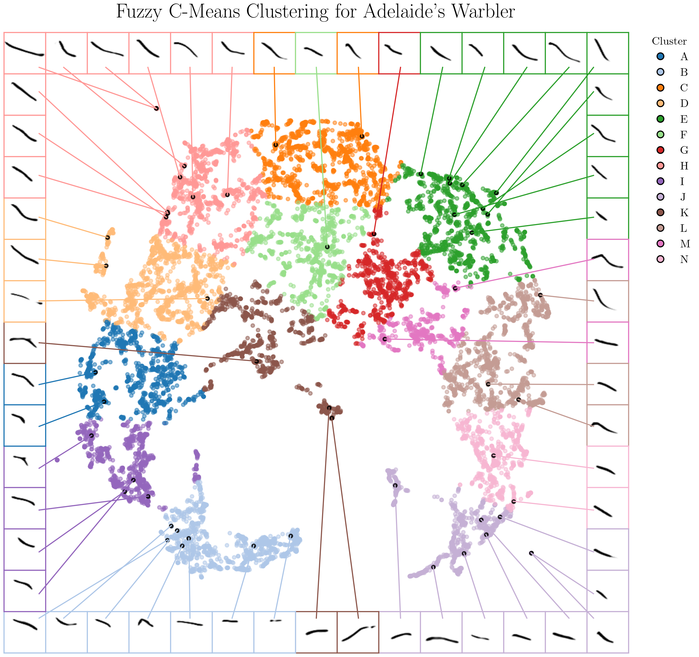
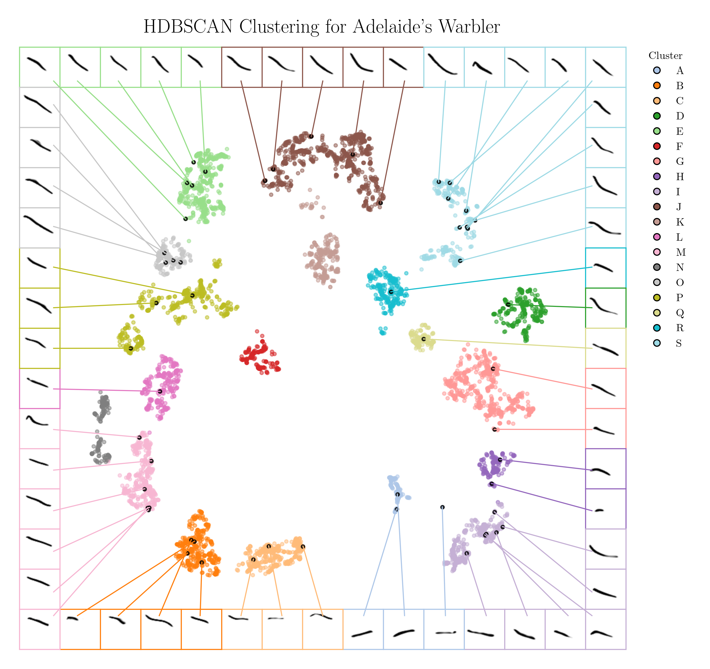

## warbler

warbler is a pipeline for segmenting, clustering and visualizing Adelaide's warbler songs, which uses a dataset from Dr. David Logue of [The Birdsong Lab](http://david-logue.squarespace.com/). This pipeline uses [UMAP](https://umap-learn.readthedocs.io/en/latest/) to perform dimensionality reduction, and [HDBSCAN](https://hdbscan.readthedocs.io/en/latest/how_hdbscan_works.html) and [Fuzzy C-Means clustering](https://fuzzy-c-means.readthedocs.io/en/latest/) for clustering. We also developed [avs](https://github.com/braycarlson/avs/) for the purpose of including or excluding noise from our dataset.

This research is motivated by the repositories of Dr. Tim Sainburg ([AVGN](https://github.com/timsainb/avgn_paper) and [vocalization segmentation](https://github.com/timsainb/vocalization-segmentation)) and Dr. Mara Thomas ([UMAP Tutorial](https://github.com/marathomas/tutorial_repo)).

## UMAP and Fuzzy C-Means Clustering

<p align="center">
    
</p>

## UMAP and HDBSCAN

<p align="center">
    
</p>

## Prerequisites

* [pyenv](https://github.com/pyenv/pyenv) or [Python 3.11.2](https://www.python.org/downloads/)
* [Graphviz](https://graphviz.org/)
* [ffmpeg](https://www.ffmpeg.org/)

### Windows

* https://graphviz.org/download/#windows

* https://ffmpeg.org/download.html#build-windows

### Linux (Debian)

```
sudo apt install graphviz graphviz-dev
```

```
sudo apt install ffmpeg
```

## Setup

### pyenv

```
pyenv install 3.11.2
```

```
pyenv local 3.11.2
```

### Virtual Environment

```
python -m venv venv
```

#### Windows

```
"venv/Scripts/activate"
```

#### Unix

```
source venv/bin/activate
```

### Packages

```
pip install -U -r requirements.txt && pip install -U -r local.txt
```
